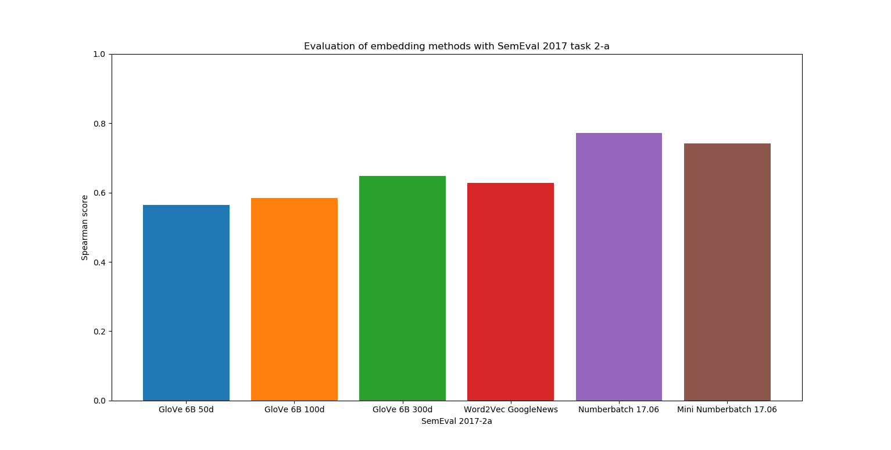
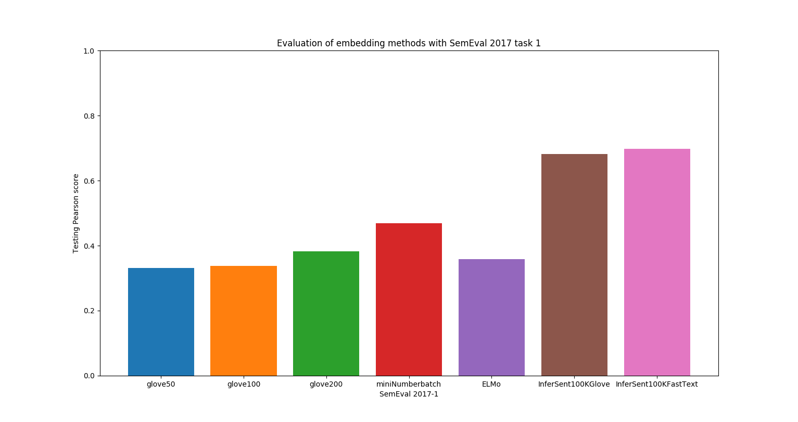
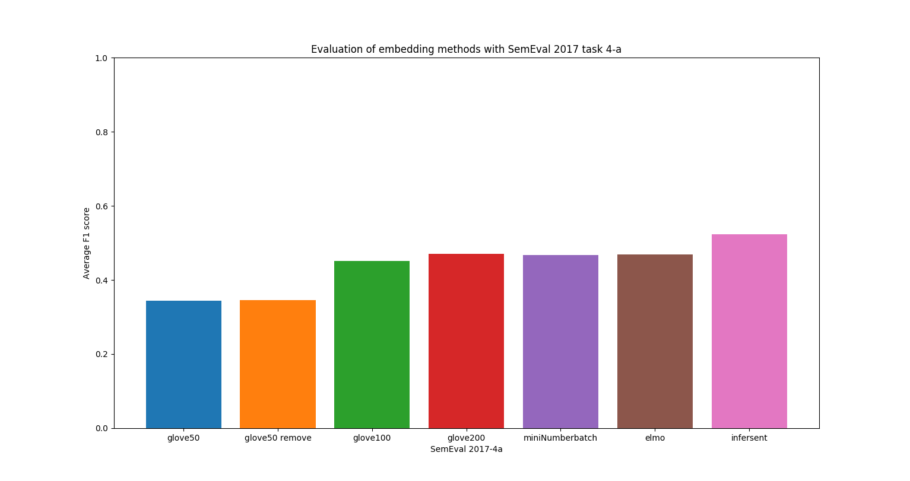

# Embedding-Comparison
Since the rise of Word Embedding and Mikolov's Word2Vec model developed in this [article](https://papers.nips.cc/paper/5021-distributed-representations-of-words-and-phrases-and-their-compositionality.pdf), a new challenge has quickly appeared: Sentence Embedding. 

In this repo, we compare different state-of-the-art sentence embedding methods and compare them in several tasks given in SemEval-2017.

# SemEval
We evaluate our models with 3 tasks from [SemEval 2017](http://alt.qcri.org/semeval2017/):
* [Task 2: Semantic Word Similarity](http://aclweb.org/anthology/S/S17/S17-2002.pdf). It focuses on Word level (Word pairs comparison).
* [Task 1: Semantic Textual Similarity](http://www.aclweb.org/anthology/S/S17/S17-2001.pdf). It focuses on Sentence level (Sentence pairs comparison).
* [Task 4: Sentiment Analysis in Twitter](http://alt.qcri.org/semeval2017/task4/data/uploads/semeval2017-task4.pdf). It focuses on Sentence level, but on a deeper one (Sentiment Analysis). 

N.B: the training for Task 4 was only done with SemEval 2016 tweets. 

# Results
* We show in Task 2 that retrofitting does improve word embedding. Indeed, the model [ConceptNet NumberBatch](https://github.com/commonsense/conceptnet-numberbatch), which uses retrofitting to "inject" ConceptNet "knowledge" in pre-trained embedding vectors, has the highest score among all the models we have tested. 

The best Pearson score (0.80) was obtained by Luminoso_run2 using ConceptNet NumberBatch.


* We show in Task 1 and Task 4 that a sentence representation is more accurate than an average of word representations. Indeed, [InferSent](https://github.com/facebookresearch/InferSent) model has obtained higher accuracy than the other word embedding models.

The best Testing Accuracy Score (0.81) was obtained by [Yang et al. 2018](https://arxiv.org/pdf/1804.07754.pdf).


The best F1 score (0.633) for Task 4 was obtained by [SwissCheese](http://www.aclweb.org/anthology/S16-1173) model, an ensemble of Convolutional Neural Networks with Distant Supervision. 


# Get started

## Requirements
Python 2 or 3

### Required libraries
scikit-learn
pytorch
nltk
gensim

### Required pre-trained models
You need to download the required embedding pre-trained models: 
[Word2Vec](https://code.google.com/archive/p/word2vec/), [GloVe](https://nlp.stanford.edu/projects/glove/), [FastText](https://github.com/facebookresearch/fastText/blob/master/pretrained-vectors.md), [InferSent](https://github.com/facebookresearch/InferSent), [ConceptNet NumberBatch](https://github.com/commonsense/conceptnet-numberbatch).

Then, git clone InferSent repository: 
```
git clone https://github.com/facebookresearch/InferSent.git
```

## SemEval Task 2
To reproduce our results, just run:
```
$ cd SemEval-2017-Task2-en
$ python sem2-main.py
The following arguments are mandatory:
  -embed        Embedding method. Availables are: glove, w2v, miniNumberbatch, elmo
  -p		Path to your embedding model.

The following arguments are optional:
  -which        If embed = elmo, choose ELMo model weights (small, medium, largeor original). Default is small.
```

For example, 
```
python sem2-main.py -embed glove -p ./GloVe/model.txt
```

## SemEval Task 1
To reproduce our results, just run:
```
$ cd SemEval-2017-Task1-en
$ python sem1-main.py
The following arguments are mandatory:
  -embed        Embedding method. Availables are: glove, w2v, miniNumberbatch, elmo, infersent
  -p            Path to your embedding model. If embed = infersent, path to InferSent repository.
  -v		If embed = infersent, choose the version: 1 (input embedding GloVe) or 2 (FastText).
  -ep		If embed = infersent, path to embedding input vectors.

The following arguments are optional:
  -which        If embed = elmo, choose ELMo model weights (small, medium, largeor original). Default is small.
```

For example,
```
python sem1-main.py -embed infersent -p ./InferSent/ -v 1 -ep ./GloVe/glove200d.vec
```

## SemEval Task 4
To reproduce our results, just run:
```
$ cd SemEval-2017-Task4-en
$ python sem4-main.py

The doc is the same as for SemEval Task 1.
```
